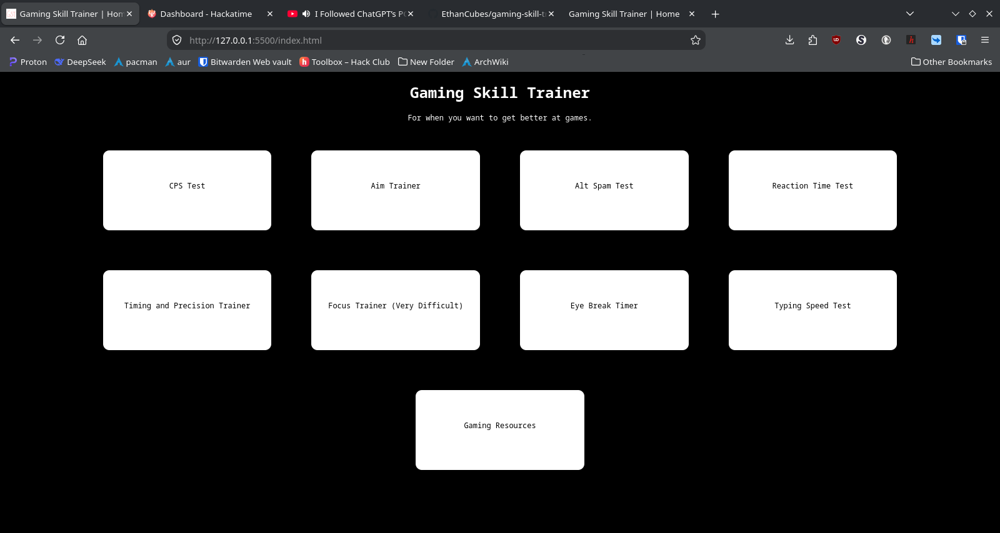

# Gaming Skill Trainer
A web app with a variety of trainers, tests, and resources to help train gamers on various skills needed for effective gaming, including aim, reaction time, click speed, typing speed, timing and precision, and even focus.

[Click Here to Try the Program](https://ethancubes.github.io/gaming-skill-trainer/)

## Table of Contents
1. [How to run locally](#how-to-run-locally)
2. [Features](#features)
3. [How it works](#how-it-works)
4. [Help](#help)
5. [Credits](#credits)

## How to run locally
I don't know why you would need to run this locally but whatever I guess. 
1. Clone or download the Git repo from GitHub.
2. You need to have either 1) Visual Studio Code, with the Live Server extension installed OR 2) live server, installed with npm.

If you have Visual Studio Code:
1. Navigate to the extensions page and install Live Server by Ritwick Dey.
2. Open the project folder, right-click index.html, and select run with live server.

If you want to use npm (node package manager) and live server:
1. If you don't have npm, install it. Official website is [here](https://nodejs.org/), or you can use apt or homebrew or pacman or whatever the hell you use.
2. In the terminal, type `npm install -g live-server`
3. Run `live-server --port=5500` to start the server.
4. Navigate to `http://localhost:5500/`, where the pages will be hosted locally.

## Features
- A cps test, aim trainer, typing speed test, and many other trainers for skills that are nice to have for gaming. 
- A focus trainer inspired by the Geometry Dash level LIMBO that involves the user tracking moving "keys" on their screen.
- A timer designed to enforce the 20-20-20 rule that helps with eye health (functional eyes are generally pretty important for gaming).
- A resources page with tons of links to helpful tutorials to games like Minecraft and Geometry Dash (that's it, there's like no tutorials for other games because I don't play other games a lot)

## How it works
A lot of JavaScript and CSS. Only vanilla JavaScript was used, no frameworks or anything. Majority of the stuff was done either by event listeners or set interval (apparently there's these things called animation frames that I could use but idk how to use them and am too lazy to change anything).

## Help
### CPS Test
- CPS stands for clicks per second.
- In this test, you are trying to click as fast as possible
- To start the test, simply click your mouse or touch the screen
- After 5 seconds, the test will end and a popup will tell you how much CPS you got
- If you want to see how much CPS you are currently getting, look at the top left. It'll display the CPS and the number of clicks you have clicked in the current test

### Aim Trainer
- Upon clicking on the circle, the test will start
- Each time you click on the circle, it will glide to a new position, where you will have to then navigate to and click on the circle again
- The test will end once you click 16 circles, give or take like one
- A popup will tell you how long it took to click all the circles. There's also a timer that shows up on the screen

### Alt Spam Test
- Alt spam is when you click two separate keys at once with two separate fingers to double your clicks per second
- If you want to learn how to actually alt spam effectively, go to the resources page as I have a video linked there that will explain it much better than I can
- This test is simular to the aforementioned CPS test, but you can click with keyboard keys; click as fast as possible

### Reaction Time Test - Click to start the test
- Don't click when the background is red. Click ASAP when then background is green

### Timing and Precision Trainer
- Click anywhere or any key to start the test
- When the circle goes across the screen, you have to click the mouse or press a key just as the circle passes over the center of the screen
- Depending on how close the circle is to the center when you click, you will get 50, 100, or 150 points
- At the end of the test, a popup will pop up saying what accuracy you got. This is calculated by dividing the amount of points you got out of the maximum possible amount of points that you could have gotten

### Focus Trainer
- Click anywhere to start the test. This test is extremely difficult and WILL take many attempts to do
- A key will glow green at the start of the test. Follow the key as it, and its accomplices move, shuffle, and flip all across the place
- At the end of the test, the keys will spring into color, and 8 buttons labeled 1-8 will appear at the bottom of the screen.
According to what color the key that glowed green at the start of the test currently is, select one of the buttons. You can do this by clicking on it, or clicking the corresponding number key
If you get it wrong, you'll know

### Eye Break Timer
- This is quite possibly the most simple program on this entire web page
- Click to start the timer. The timer will go on for 20 minutes before going off. When that happens, take a break from the screen for 20 seconds and stare at something at least 20 feet away
- When you click again, the timer will start again, and the cycle forever repeats (you can end this by pressing the "go home" button

### Typing Speed Test
- There will be a large block of text on the screen. Once you start typing, the timer starts to time you
- When you finish typing, the program will calculate your typing speed and generate a new block of words for you to type
- And thus the cycle shall continue forevermore (unless you click the "go home" button)

## Credits
- This [Stack Overflow question](https://stackoverflow.com/questions/8454510/open-url-in-same-window-and-in-same-tab) helped with opening the link in the same tab.
- This [Stack Overflow question](https://stackoverflow.com/questions/9419263/how-to-play-audio) helped with playing audio for the timer ringtone.
- [DeepSeek](deepseek.com) helped with debugging, as much as I don't want to admit it.
- The Focus trainer was inspired by [MindCap](https://youtube.com/mindcap./)'s 2.1 Extreme Demon megacollaboration called LIMBO. The name "focus" was inspired by the message that appears right before LIMBO's first drop. The movement of the "keys" is a direct copy of the ending of LIMBO, except that the ending of LIMBO was made in Geometry Dash before the addtion of any true random events and mine was made in JavaScript, which convieniently contains a Math.random() function that I still don't know how it works.
- The scoring system in the timing and precision trainer (not to be confused with the timer) is inspired by the rhythm game [osu!](https://osu.ppy.sh/). That's where the "Great", "Okay", and "Meh" come from. Originally, getting a great would give you 300 points, like in osu!, but since the timing trainer didn't nearly have the amount of changes to gain score, I had to change it to 150 to balance stuff out.
- The song that plays when the timer hits zero is "Sphere" by Creo. It is licensed under CC 4.0, which means that I am free to use it in any way I want as long as I give attribution to Creo and give a link to it's license, which will be [here](https://creativecommons.org/licenses/by/4.0/)
- [w3schools](https://w3schools.com/), [geeksForGeeks](https://geeksforgeeks.org/), and [MDN Web Docs](https://developer.mozilla.org/) all helped a lot with knowing what commands to use and what they do. As much as I've become used to coding in JavaScript, there's still a lot I don't know (or that I tend to forget). I've done 3 projects that are web apps now, and still I tend forget things that I should probably remember. In fact, I used so much w3schools and geeksForGeeks that a list of all the documentation pages I visited would probably be bigger than this README.
- I used the [Zeal Documentation Browser](https://zealdocs.org/) when I was offline and needed to search something up. To be honest, it's not the easiest experience using Zeal and I definitely prefer online documentation more, but it was a great help when offine.
- This program was written in [Visual Studio Code](https://code.visualstudio.com/) and [Vim](https://www.vim.org/). Even inside of VSCode, I was using the Vim extension. This is also my first time coding a project with Vim, and somehow I didn't struggle that much and now I'm addicted and definitely part of the Cult of Vi(M).
- The favicon was made in about 30 seconds in [Krita](https://krita.org/) and converted into an .ico file with [FFmpeg](https://ffmpeg.org/). Maybe just like renaming the file would've worked and maybe FFmpeg did nothing, but whatever. I guess you can call it low effort, but it's not like I can make it much better even if I tried.
The Help button was also made in Krita, also in about 30 seconds, but this time I think it actually somewhat looks good. Actually, on second thought it looks mediocre at best but I mean it's just a icon that didn't ever need to exist anyway.

