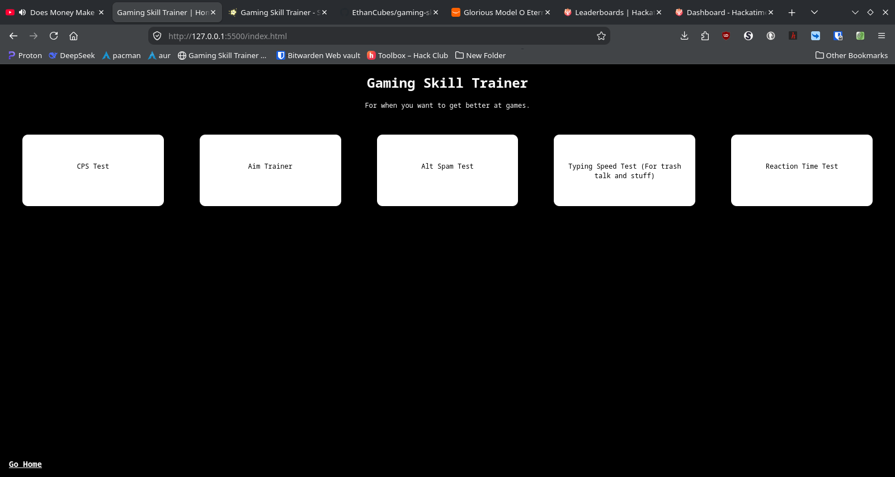

# Gaming Skill Trainer
A web app with a variety of pages to help train gamers on various skills needed for effective gaming, including aim, reaction time, click speed, and even timing.

## [Click Here to Try the Program](https://ethancubes.github.io/gaming-skill-trainer/)

## How to run locally
I don't know why you would need to run this locally but whatever I guess. 
1. Clone or download the Git repo from GitHub.
2. Go into the script.js file and scroll down to the comment that says to change this "ethancubes" to whatever your username is. Do what it says.
3. Just run index.html. If you really need like commands or instructions for this step, then you probably should not be on GitHub. 

## How it works
A lot of JavaScript and CSS. Only vanilla JavaScript was used, no frameworks or anything. Majority of the stuff was done either by event listeners or set interval.

## Credits
- This [Stack Overflow question](https://stackoverflow.com/questions/8454510/open-url-in-same-window-and-in-same-tab) helped with opening the link in the same tab.
- This [Stack Overflow question](https://stackoverflow.com/questions/9419263/how-to-play-audio) helped with playing audio for the timer ringtone.
- [DeepSeek](deepseek.com) helped with debugging, as much as I don't want to admit it.
- The Focus trainer was inspired by [MindCap](https://youtube.com/mindcap./)'s 2.1 Extreme Demon megacollaboration called LIMBO. The name "focus" was inspired by the message that appears right before LIMBO's first drop. The movement of the "keys" is a direct copy of the ending of LIMBO, except that the ending of LIMBO was made in Geometry Dash without any true random events and mine was made in JavaScript, which convieniently contains a Math.random() function that I still don't know how it works.
- The scoring system in the timing trainer (not to be confused with the timer) is inspired by the rhythm game osu!. That's where the "Great", "Okay", and "Meh" come from. Originally, getting a great would give you 300 points, like in osu!, but since the timing trainer didn't nearly have the amount of changes to gain score, I had to change it to 150 to balance stuff out.
- The song that plays when the timer hits zero is "Sphere" by Creo. It is licensed under CC 4.0, which means that I am free to use it in any way I want as long as I give attribution to Creo and give a link to it's license, which will be [here]()
- [w3schools](https://w3schools.com/), [geeksForGeeks](https://geeksforgeeks.org/), and [MDN Web Docs](https://developer.mozilla.org/) all helped a lot with knowing what commands to use and what they do. As much as I've become used to coding in JavaScript, there's still a lot I don't know (or that I tend to forget).
- This program was written in [Visual Studio Code](https://code.visualstudio.com/) and [Vim](https://www.vim.org/). Even inside of VSCode, I was using the Vim extension.
- The favicon was made in about 30 seconds in [Krita](https://krita.org/) and converted into an .ico file with [FFmpeg](https://ffmpeg.org/). Maybe just like renaming the file would've worked and maybe FFmpeg did nothing, but whatever. I guess you can call it low effort, but it's not like I can make it much better even if I tried.

